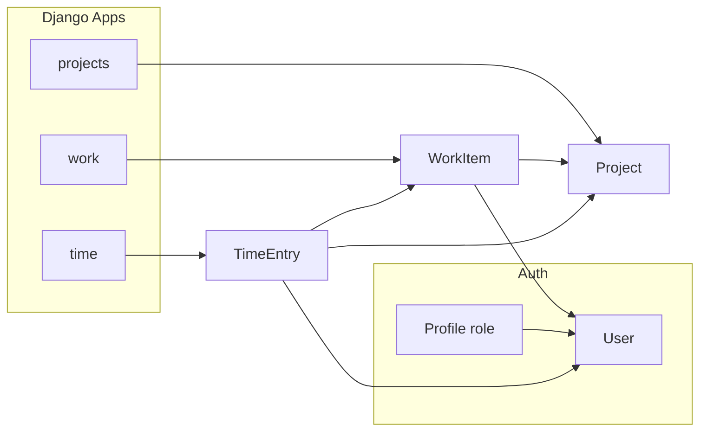

# Django GC Scheduling Internal Tool

## Architecture




- **Project name**: `gc_scheduler` (config package) with apps: `projects`, `work`, `time`.
- **Database**: SQLite, path `BASE_DIR / 'db.sqlite3'` (default).
- **Auth**: Django `django.contrib.auth`; roles via a **Profile** model (OneToOne to User, `role` choices: `manager` / `scheduler`) for simple view logic and no extra group-management in code. Middleware or view decorators will enforce manager vs scheduler rules.

---

## 1. Project setup

- **Location**: New folder `gc_scheduler` (or user-chosen name) at workspace root containing the Django project and apps.
- **Dependencies**: Only Django in `requirements.txt` (e.g. `Django>=4.2,<5`). No frontend framework; minimal, robust stack.
- **Settings** (in `gc_scheduler/settings.py`):
  - `INSTALLED_APPS`: `django.contrib.auth`, `projects`, `work`, `time`, admin, sessions, etc.
  - `DATABASES`: default engine `django.db.backends.sqlite3`, `NAME`: `BASE_DIR / 'db.sqlite3'`.
  - `LOGIN_URL` / `LOGIN_REDIRECT_URL` (e.g. `/`).
  - `STATIC_URL` and `STATIC_ROOT` (for PythonAnywhere: `STATIC_ROOT = os.path.join(BASE_DIR, 'static')`).
  - No environment-specific settings split required for minimal setup; optional `python-dotenv` and `DEBUG`/`SECRET_KEY` from env can be added later.

---

## 2. Apps and models

### 2.1 Core / auth: Profile

- **Option**: Add a small `core` app or attach Profile to the app that “owns” users (e.g. `projects` or a dedicated `accounts` app). Recommended: `**core` app** with a single model `Profile(User, role)`.
- **Profile**: `OneToOneField(User, on_delete=CASCADE)`, `role` CharField with choices `('manager','scheduler')`. Create/update Profile on User save (signal or in admin/registration flow). Helper: `user.profile.role == 'manager'` (with existence check or default).

### 2.2 App: `projects`

- **Project**: `name` (CharField), `client` (CharField), `pm` (CharField), `status` (CharField with choices, e.g. active/on_hold/complete), `notes` (TextField, blank=True). `__str__` → name.

### 2.3 App: `work`

- **WorkItem**:  
  - `project` FK → `projects.Project` (CASCADE).  
  - `title`, `work_type` (CharField), `priority` (CharField, choices P0–P3), `due_date` (DateField, null/blank optional), `status` (CharField, e.g. open/in_progress/done).  
  - `assigned_to` FK → `auth.User` (SET_NULL, null=True, blank=True), `requested_by` (CharField, blank=True), `notes` (TextField, blank=True).  
  - `created_at`, `updated_at` (auto_now_add / auto_now).

### 2.4 App: `time`

- **TimeEntry**:  
  - `user` FK → User (CASCADE), `project` FK → Project (CASCADE), `work_item` FK → WorkItem (SET_NULL, null=True, blank=True).  
  - `date` (DateField), `hours` (DecimalField), `description` (TextField, blank=True).
- **Integrity**: Optional `clean()` or DB constraint so that when `work_item` is set, `work_item.project_id == project_id`.

---

## 3. Permissions (view layer)

- **Scheduler**:
  - **TimeEntry**: Queryset filtered by `user=request.user` (view and edit only own).
  - **WorkItem**: Queryset filtered by `assigned_to=request.user` (view and edit only assigned).
- **Manager**:
  - Unfiltered access to projects, work items, time entries; can assign work (set `WorkItem.assigned_to`).
- **Implementation**:
  - Use a **mixin** (e.g. `ManagerRequiredMixin`) that checks `request.user.profile.role == 'manager'` and returns 403 or redirect if not manager (for dashboard, projects list/create).
  - For “scheduler-only” views (my-work, time), allow only schedulers (and optionally managers); filter querysets by `assigned_to` / `user` for schedulers.
  - No need for Django’s permission backend on models for this; role-based view logic + filtered querysets are enough. Optionally restrict admin by overriding `ModelAdmin.get_queryset` for scheduler staff later.

---

## 4. URLs and views (templates, no JS framework)


| Path                                    | Who       | Purpose                                                                                           |
| --------------------------------------- | --------- | ------------------------------------------------------------------------------------------------- |
| `/`                                     | Manager   | Dashboard: overdue work items, due this week, hours by project this week, hours by user this week |
| `/my-work/`                             | Scheduler | Assigned work items; filters: overdue, due soon, status                                           |
| `/time/`                                | Scheduler | Quick add time entry + weekly list with edit/delete                                               |
| `/projects/`                            | Manager   | List projects; link to create                                                                     |
| `/projects/create/`                     | Manager   | Create project form                                                                               |
| `/accounts/login/`, `/accounts/logout/` | All       | Django auth views (or custom login template)                                                      |


- **Dashboard (/)**:  
  - Overdue: `WorkItem` with `due_date__lt=today`, `status` not “done”.  
  - Due this week: `due_date` in [today, end_of_week].  
  - Hours by project this week: `TimeEntry` filtered by `date` in week, aggregate by `project`.  
  - Hours by user this week: same, aggregate by `user`.  
  - Template: tables or cards; links to work items/projects as needed.
- **My work (/my-work/)**:  
  - List `WorkItem.objects.filter(assigned_to=request.user)` with optional GET params: e.g. `overdue=1`, `due_soon=1` (e.g. next 7 days), `status=...`.  
  - Simple HTML form for filters; table of work items with link to edit (if you add an edit view) or at least detail.
- **Time (/time/)**:  
  - Form at top: project (dropdown), optional work_item (filtered by project), date, hours, description; POST to create.  
  - Below: list of current user’s time entries for “this week” (or selected week) with inline edit links or small forms (edit/delete). One view with two forms (add + list) is enough; optional separate edit URL.
- **Projects**:  
  - List view (manager): all projects; link “Add project” → create view.  
  - Create view: ModelForm for `Project`; redirect to list on success.
- **Templates**:  
  - Base template: nav (Dashboard / My work / Time / Projects with visibility by role), ``, include messages.  
  - One template per main view (dashboard, my_work, time, project_list, project_form).  
  - Use Django templates only; no Vue/React.

---

## 5. Django admin

- **projects**: Register `Project`; `list_display`: name, client, pm, status; `list_filter`: status; `search_fields`: name, client, pm.
- **work**: Register `WorkItem`; `list_display`: title, project, work_type, priority, due_date, status, assigned_to; `list_filter`: priority, status, work_type; `search_fields`: title, notes; `date_hierarchy`: due_date.
- **time**: Register `TimeEntry`; `list_display`: user, project, work_item, date, hours, description (truncated); `list_filter`: date, user; `search_fields`: description.
- **core**: Register `Profile` (or inline on User); `list_filter`: role; `search_fields`: user__username.

---

## 6. Seed data (dev)

- **Option A – Fixtures**: Create JSON fixtures for User (with passwords hashed), Profile (manager + 1–2 schedulers), Project (2–3), WorkItem (several, mixed assigned/overdue/due this week), TimeEntry (per user, this week). Load with `loaddata`.
- **Option B – Management command**: `python manage.py seed_scheduler` that creates 1 manager, 2 schedulers, 2–3 projects, 5–10 work items, and ~10 time entries for the current week. Prefer **management command** so passwords and dates stay controllable (e.g. “today” and “this week”).
- Command can live in `core` or in a single app (e.g. `core/management/commands/seed_scheduler.py`).

---

## 7. PythonAnywhere deployment notes (document)

Add a markdown file (e.g. `DEPLOY_PYTHONANYWHERE.md`) in the project root with:

- **Assumptions**: Free account; code in `/home/<username>/gc_scheduler/` (or repo clone path); SQLite in project directory (e.g. `/home/<username>/gc_scheduler/db.sqlite3`). No MySQL required.
- **Steps**:
  1. Clone repo / upload code to `/home/<username>/gc_scheduler/`.
  2. Create virtualenv: `mkvirtualenv --python=python3.10 gc_scheduler` (or current PA Python); `pip install -r requirements.txt`.
  3. Web tab: Create web app → **Manual configuration** (same Python as venv).
  4. Virtualenv: set to `gc_scheduler` (or full path `~/.virtualenvs/gc_scheduler`).
  5. **WSGI file** (link from Web tab, e.g. `/var/www/<username>_pythonanywhere_com_wsgi.py`): set `path = '/home/<username>/gc_scheduler'`, `sys.path.insert(0, path)`, `os.environ['DJANGO_SETTINGS_MODULE'] = 'gc_scheduler.settings'`, and `application = get_wsgi_application()`.
  6. **Static files**: In `settings.py`, `STATIC_ROOT = os.path.join(BASE_DIR, 'static')`. Run `python manage.py collectstatic`. In Web tab → Static files: URL `/static/`, path `/home/<username>/gc_scheduler/static`.
  7. **Database**: In console, `cd /home/<username>/gc_scheduler`, `python manage.py migrate`; optionally create superuser and run seed command.
  8. **Reload** the web app; test `/`, `/admin/`, login.
- **SQLite**: Stored inside project folder; no extra DB setup. Ensure app has write permission to that directory (default for user home).
- **Limits**: Free tier CPU/disk; single worker; no long-running tasks. Link to [Free accounts](https://help.pythonanywhere.com/pages/FreeAccountsFeatures/) for reference.

---

## 8. File structure (summary)

```
gc_scheduler/                    # project root (repo root)
├── manage.py
├── requirements.txt
├── DEPLOY_PYTHONANYWHERE.md
├── gc_scheduler/                # config package
│   ├── __init__.py
│   ├── settings.py
│   ├── urls.py
│   └── wsgi.py
├── core/
│   ├── models.py                # Profile
│   ├── admin.py
│   ├── management/commands/
│   │   └── seed_scheduler.py
│   └── ...
├── projects/
│   ├── models.py                # Project
│   ├── views.py, urls.py, forms.py
│   ├── admin.py
│   └── templates/projects/      # list, form
├── work/
│   ├── models.py                # WorkItem
│   ├── views.py, urls.py, forms.py
│   ├── admin.py
│   └── templates/work/          # my_work, dashboard data
├── time/
│   ├── models.py                # TimeEntry
│   ├── views.py, urls.py, forms.py
│   ├── admin.py
│   └── templates/time/          # time entry list + quick add
└── templates/
    └── base.html                # nav by role, blocks
```

- **Root `urls.py**`: Include `path('', include('core.urls'))` or a single `urls.py` that includes app urlconfs and `path('admin/', admin.site.urls)`, `path('accounts/', include('django.contrib.auth.urls'))` (or custom login view).

---

## 9. Implementation order (suggested)

1. Create Django project and apps; set SQLite and `STATIC_ROOT` in settings.
2. Implement `core.Profile` and migration; ensure Profile created for users (signal or in admin).
3. Implement `projects.Project` and migration; admin.
4. Implement `work.WorkItem` and migration; admin.
5. Implement `time.TimeEntry` and migration; admin.
6. Add mixins and login redirect; wire `LOGIN_URL`.
7. Dashboard view and template (manager); then projects list/create.
8. My-work view and template (scheduler) with filters.
9. Time view: quick add + weekly list/edit (scheduler).
10. Base template and nav (role-based links).
11. Seed management command and test data.
12. Write `DEPLOY_PYTHONANYWHERE.md` and finalize `requirements.txt`.

No code will be written until you confirm this plan; adjustments (e.g. project name, use groups instead of Profile, or extra fields) can be made before implementation.